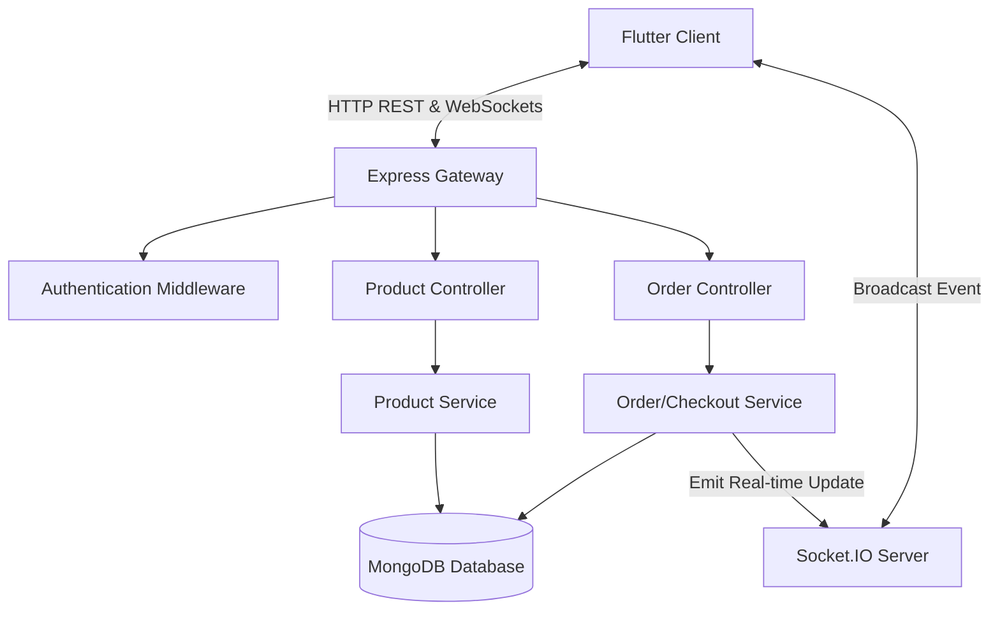

# QuickCart Live

QuickCart Live is a production-ready, real-time e-commerce application consisting of a robust Node.js Express backend and a clean, responsive Flutter client mobile application built with GetX. 

The application is engineered to maintain high data integrity, specifically implementing atomic checkout operations to prevent inventory overselling during high concurrency scenarios.

---

## Project Features

* **Real-time Inventory Management**: Connected clients receive instant stock updates on checkout or catalog changes using Socket.IO.
* **Strict Concurrency Protection**: High-volume checkout requests are validated atomically using Mongoose `findOneAndUpdate()` with conditional stock checking and atomic operators.
* **Comprehensive Authentication**: JWT-based session checks, cookie parsing, route restrictions, and customer/admin role-based gates.
* **Responsive Material Design**: Premium client interface with splash, dynamic login/register, list catalog status, and product specifications.
* **Robust Error Resilience**: Dynamic error-handling screen fallbacks with user-friendly retry controls.

---

## Technology Stack

### Backend
* **Runtime**: Node.js
* **Framework**: Express.js
* **Database**: MongoDB Atlas + Mongoose
* **Realtime**: Socket.IO
* **Testing**: Jest + Supertest
* **Security**: Helmet + CORS + Cookie-Parser + Bcrypt + JWT

### Frontend (Flutter Client)
* **Framework**: Flutter Stable (Material 3 theme)
* **State Management & DI**: GetX
* **Networking**: HTTP
* **Realtime Client**: Socket.IO Client Dart
* **Local Storage**: GetStorage

---

## Project Architecture



---

## Repository Structure

```
QuickCart/
├── backend/                  # Node.js + Express API
│   ├── src/
│   │   ├── config/           # DB, Socket, Env Configurations
│   │   ├── controllers/      # Route handler operations
│   │   ├── middleware/       # JWT auth, 404, error handler
│   │   ├── models/           # Mongoose schemas (User, Product, Order)
│   │   ├── routes/           # central router routes
│   │   ├── services/         # business logic definitions
│   │   ├── utils/            # snacks, tokens utilities
│   │   └── tests/            # Jest test suites
│   ├── server.js             # Express startup file
│   └── package.json          # Node scripts and dependencies
├── frontend/                 # Flutter Mobile App
│   ├── lib/
│   │   ├── core/             # Bindings, Config, Routing, Services
│   │   └── modules/          # Auth, Dashboard, Product, Order (MVVM)
│   └── pubspec.yaml          # Flutter package definitions
└── docs/                     # Comprehensive Architecture & Scaling Guides
```

---

## Environment Variables

Configure these variables in `backend/.env` or in your host (e.g. Render) settings:

```env
PORT=5000
NODE_ENV=production
MONGO_URI=mongodb+srv://<user>:<password>@cluster.mongodb.net/quickcart_live
JWT_SECRET=your-secure-jwt-key
JWT_EXPIRES_IN=7d
COOKIE_SECRET=your-secure-cookie-key
CLIENT_URL=https://quickcart-live.vercel.app,http://localhost:3000
```

---

## Running the Backend

1. Navigate to directory:
   ```bash
   cd backend
   ```
2. Install dependencies:
   ```bash
   npm install
   ```
3. Seed the admin credentials and products catalog:
   ```bash
   npm run seed
   ```
4. Run the local dev server:
   ```bash
   npm run dev
   ```
5. Run automated tests (runs integration, unit, and concurrency checks):
   ```bash
   npm test
   ```

---

## Running Flutter

1. Navigate to directory:
   ```bash
   cd frontend
   ```
2. Fetch package dependencies:
   ```bash
   flutter pub get
   ```
3. Set the environment profile in `frontend/lib/core/config/app_config.dart`:
   * Change `environment = 'development'` to run against your local server loopback (`http://10.0.2.2:5000`).
   * Change `environment = 'production'` to run against the live cloud instance.
4. Run app:
   ```bash
   flutter run
   ```

---

## API Overview

### Authentication
* `POST /api/v1/auth/register` - Create client credentials.
* `POST /api/v1/auth/login` - Secure login returning JWT.

### Products Catalog
* `GET /api/v1/products` - Returns active inventory.
* `GET /api/v1/products/:id` - Fetch item specifications.
* `POST /api/v1/products` - Register new item (Admin only).
* `PUT /api/v1/products/:id` - Modify item configurations (Admin only).
* `DELETE /api/v1/products/:id` - Soft delete item (Admin only).

### Checkout & Orders
* `POST /api/v1/checkout` - Purchase single item (Customer only, concurrency-guarded).
* `GET /api/v1/orders` - Retrieve historical user orders.

---

## Real-Time Inventory Updates

The application integrates WebSockets via Socket.IO. When checkout processes successfully:
1. The server broadcasts a `STOCK_UPDATED` event containing `{ productId, stock }`.
2. Active Flutter clients listening to the socket dynamically update the reactive `ProductController.products` list.
3. The catalog screen and individual product specification screens update instantly in-memory without requiring manual reloads.

---

## Concurrency Protection (Preventing Overselling)

To guarantee that the database never oversells an item when multiple clients attempt to buy the last remaining stock concurrently:
* **Atomic MongoDB Check**: The checkout service executes a single atomic Mongoose `findOneAndUpdate()` operation with a conditional `stock: { $gt: 0 }` filter.
* **Database Level Decrement**: When checkout executes, stock is decremented atomically at the database engine level:
  ```javascript
  const updatedProduct = await Product.findOneAndUpdate(
    {
      _id: productId,
      isActive: true,
      stock: { $gt: 0 },   // Guard: only proceed if stock > 0
    },
    {
      $inc: { stock: -1 }, // Atomically decrement by exactly 1
    },
    {
      new: true,           // Return the document AFTER the update
    }
  );
  ```
* **Strict Fallback**: If the query fails to find a matching active document with sufficient stock (i.e. stock is 0), `findOneAndUpdate()` returns `null`. The checkout service immediately aborts and returns `409 Out of Stock`.

---

## Deployment

* **Backend**: Deployed as a web service on Render, with dynamic CORS arrays, process port configurations, and graceful termination hooks.
* **Frontend**: Can be compiled to a release Android APK:
  ```bash
  flutter build apk --release
  ```

---

## Documentation

## Additional Documentation

- docs/api.md
- docs/architecture.md
- docs/deployment.md
- docs/scaling.md
- docs/release-checklist.md
- docs/team-collaboration.md

---

## Future Improvements

* **Redis Cache Layer**: Integrate Redis cache on the `GET /products` catalog endpoint to minimize query loads during heavy traffic.
* **Interactive Chat / Notification Service**: Live delivery tracking sockets.
* **Widget & Controller Verification**: Set up comprehensive Flutter testing scripts to cover edge-cases.

---

## Author

Bhargav Gokani - [GitHub](https://github.com/bhargavgokani)
